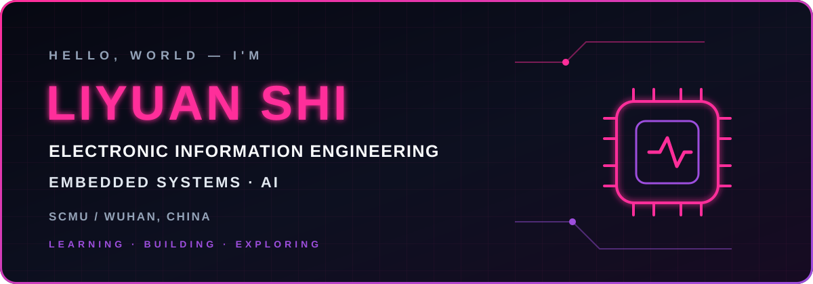

  

  
  

<h2>👾 About Me</h2>

An Electronic Information Engineering student at **South-Central Minzu University**, learning embedded development, exploring AI, and building practical projects along the way.

- 📍 Wuhan, China
- 🎓 Electronic Information Engineering @ SCMU
- ⚡ Focused on embedded systems and intelligent hardware

  
<h2>💾 Featured Projects</h2>

  

    
    
    
  

<h2>🛠️ Tech Stack</h2>

<h3>💻 Programming Languages</h3>

<h3>🔧 Embedded Systems</h3>

<h3>🧠 Currently Exploring</h3>

 

  

<em>Bringing AI into the physical world.</em>

